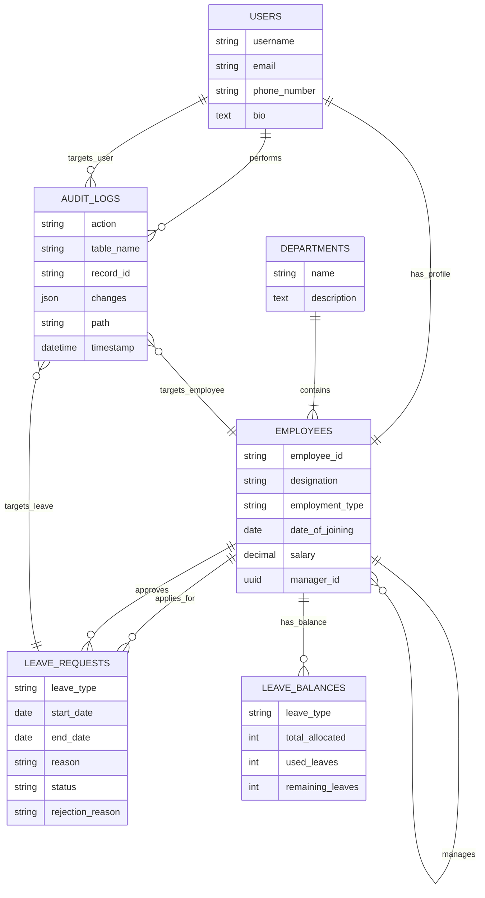

# 🏢 HRMS Backend API (Human Resource Management System)

A production-ready, domain-driven Backend API for Human Resource Management built with **Django 6.0** and **Django Rest Framework (DRF)**.

This system handles complex HR workflows including Leave Management, Organization Hierarchies, and Automated Audit Logging, secured via Role-Based Access Control (RBAC) and JWT Authentication.

---

## 🚀 Key Features

### 🔹 Core Modules

- **Leave Management**
  - Automated balance checking against `LeaveBalance`.
  - Strict validation preventing past dates and overlapping requests.
  - Manager approval workflow (Approve/Reject with mandatory reasoning).

- **Organization Structure**
  - Hierarchical management of `Employees` and `Departments`.
  - Supports **Manager → Subordinate** relationships.
  - Versioned API design (`v1`, `v2`) for future-proof scalability.

- **Audit & Compliance**
  - **Automated Logging:** Custom Middleware captures every request (User, IP, Path, Method) and stores it for accountability.
  - **Resilient Auth:** Captures actor details even if the request uses raw JWT headers.

### 🔹 Security & Architecture

- **JWT Authentication:** Secure, stateless token-based auth using `SimpleJWT`.
- **RBAC:** Granular permissions differentiating Admins, Managers, and Employees.
- **UUID Primary Keys:** Protects against ID enumeration attacks.
- **Environment Isolation:** Secrets managed via `.env` files using `django-environ`.

---

## 🛠️ Tech Stack

- **Framework:** Python 3.13, Django 6.0, Django Rest Framework 3.16  
- **Database:** PostgreSQL  
- **Authentication:** JSON Web Tokens (JWT) via `djangorestframework-simplejwt`  
- **Documentation:** OpenAPI 3.0 (Swagger / Redoc) via `drf-spectacular`  
- **Utilities:** `django-filter`, `corsheaders`, `django-environ`

---

## 🧩 ER Diagram



---

## 📂 Project Structure

```text
hrms_project/
├── .env                    # Environment variables (Secrets)
├── manage.py               # Django Task Runner
├── requirements.txt        # Dependencies
├── hrms/                   # ⚙️ Configuration Package (Settings, WSGI, ASGI)
├── apps/                   # 📦 Business Logic (Domain Apps)
│   ├── audit/              # Audit Logs & Middleware
│   ├── leaves/             # Leave Requests & Balances
│   ├── organization/       # Employees & Departments
│   └── users/              # Authentication & User Models
├── media/                  # User Uploads
├── static/                 # Development Static Files
└── staticfiles/            # Production Static Assets (Collected)
```

---

## ⚡ Getting Started

### Prerequisites

- Python 3.13+
- PostgreSQL
- Git

### 1. Clone the Repository

```bash
git clone https://github.com/yourusername/hrms-backend.git
cd hrms-backend
```

### 2. Create Virtual Environment

```bash
python -m venv venv
# Windows
venv\Scripts\activate
# Mac/Linux
source venv/bin/activate
```

### 3. Install Dependencies

```bash
pip install -r requirements.txt
```

### 4. Configure Environment

```bash
cp .env.template .env
```

```ini
DEBUG=<DEBUG>
DJANGO_SECRET_KEY=<DJANGO_SECRET_KEY>
DB_NAME=<DB_NAME>
DB_USER=<DB_USER>
DB_PASSWORD=<DB_PASSWORD>
DB_HOST=<DB_HOST>
DB_PORT=<DB_PORT>
ALLOWED_HOSTS=<ALLOWED_HOSTS>
```

### 5. Run Migrations

```bash
python manage.py makemigrations
python manage.py migrate
```

### 6. Create Superuser

```bash
python manage.py createsuperuser
```

### 7. Run Server

```bash
python manage.py runserver
```

---

## 📖 API Documentation

- **Swagger UI:** http://localhost:8000/api/schema/swagger-ui/
- **Redoc:** http://localhost:8000/api/schema/redoc/

---

## 🔒 Security Best Practices

1. UUIDs for IDs to prevent enumeration attacks.
2. Environment isolation — secrets are never hardcoded.
3. Strict Audit Middleware ensures **no request goes unlogged**, even with raw JWT headers.
