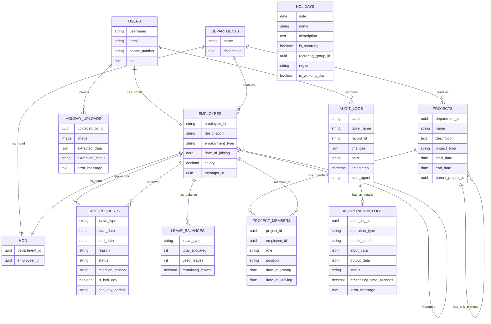

# 🏢 HRMS Backend API (Human Resource Management System)

A production-ready, domain-driven Backend API for Human Resource Management built with **Django 6.0** and **Django Rest Framework (DRF)**.

This system handles complex HR workflows including Leave Management, Holiday Management, Project & Team Management, Organization Hierarchies with HOD support, AI-powered OCR for holiday extraction, and Automated Audit Logging, secured via Role-Based Access Control (RBAC) and JWT Authentication.

---

## 🚀 Key Features

### 🔹 Core Modules

- **Leave Management**
  - Automated balance checking against `LeaveBalance`.
  - Strict validation preventing past dates, overlapping requests, and holidays.
  - Half-day leave support with configurable periods.
  - Bulk leave request creation (up to 5 requests at once).
  - Manager approval workflow (Approve/Reject with mandatory reasoning).

- **Holiday Management**
  - Recurring holiday support with automatic generation for next 5 years.
  - Regional holiday configuration (All India, Mumbai, Bangalore, etc.).
  - AI-powered OCR extraction from holiday list images using Google Gemini.
  - Working day override for compensatory Saturdays.
  - Bulk holiday creation and upload audit trail.

- **Project & Team Management**
  - Hierarchical project structure with parent-child relationships.
  - Project types: Permanent teams and Project-based teams.
  - Project member management with roles and positions (Leader, Co-Leader, Member).
  - Department-based project organization.
  - Date validation ensuring sub-projects fall within parent project timelines.

- **Organization Structure**
  - Hierarchical management of `Employees` and `Departments`.
  - Head of Department (HOD) model with department-level permissions.
  - Supports **Manager → Subordinate** relationships.
  - Auto-generated unique employee IDs.
  - Soft delete support for all entities.

- **AI Services**
  - Google Gemini integration for OCR and NLP tasks.
  - Detailed AI operation logging with processing time tracking.
  - Structured holiday extraction from images with validation.
  - Error handling and retry mechanisms.

- **Audit & Compliance**
  - **Automated Logging:** Custom Middleware captures every request (User, Path, Method, User Agent) and stores it for accountability.
  - **AI Operation Tracking:** Separate logs for AI service calls with input/output data.
  - **Resilient Auth:** Captures actor details even if the request uses raw JWT headers.

### 🔹 Security & Architecture

- **JWT Authentication:** Secure, stateless token-based auth using `SimpleJWT`.
- **RBAC:** Granular permissions differentiating Admins, Managers, and Employees.
- **UUID Primary Keys:** Protects against ID enumeration attacks.
- **Environment Isolation:** Secrets managed via `.env` files using `django-environ`.

---

## 🛠️ Tech Stack

- **Framework:** Python 3.13, Django 6.0, Django Rest Framework 3.16  
- **Database:** PostgreSQL  
- **Authentication:** JSON Web Tokens (JWT) via `djangorestframework-simplejwt`  
- **Documentation:** OpenAPI 3.0 (Swagger / Redoc) via `drf-spectacular`  
- **Utilities:** `django-filter`, `corsheaders`, `django-environ`

---

## 🧩 ER Diagram


```mermaid
erDiagram
    USERS {
        string username
        string email
        string phone_number
        text bio
    }

    DEPARTMENTS {
        string name
        text description
    }

    EMPLOYEES {
        string employee_id
        string designation
        string employment_type
        date date_of_joining
        decimal salary
        uuid manager_id
    }

    USERS ||--|| EMPLOYEES : has_profile
    DEPARTMENTS ||--|{ EMPLOYEES : contains
    EMPLOYEES ||--o{ EMPLOYEES : manages

    HOD {
        uuid department_id
        uuid employee_id
    }

    DEPARTMENTS ||--|| HOD : has_head
    EMPLOYEES ||--|| HOD : is_head

    LEAVE_REQUESTS {
        string leave_type
        date start_date
        date end_date
        string reason
        string status
        string rejection_reason
        boolean is_half_day
        string half_day_period
    }

    LEAVE_BALANCES {
        string leave_type
        int total_allocated
        int used_leaves
        decimal remaining_leaves
    }

    EMPLOYEES ||--o{ LEAVE_REQUESTS : applies_for
    EMPLOYEES ||--o{ LEAVE_REQUESTS : approves
    EMPLOYEES ||--o{ LEAVE_BALANCES : has_balance

    HOLIDAYS {
        date date
        string name
        text description
        boolean is_recurring
        uuid recurring_group_id
        string region
        boolean is_working_day
    }

    HOLIDAY_UPLOADS {
        uuid uploaded_by_id
        image image
        json extracted_data
        string extraction_status
        text error_message
    }

    USERS ||--o{ HOLIDAY_UPLOADS : uploads

    PROJECTS {
        uuid department_id
        string name
        text description
        string project_type
        date start_date
        date end_date
        uuid parent_project_id
    }

    PROJECT_MEMBERS {
        uuid project_id
        uuid employee_id
        string role
        string position
        date date_of_joining
        date date_of_leaving
    }

    DEPARTMENTS ||--o{ PROJECTS : contains
    PROJECTS ||--o{ PROJECTS : has_sub_projects
    PROJECTS ||--o{ PROJECT_MEMBERS : has_members
    EMPLOYEES ||--o{ PROJECT_MEMBERS : member_of

    AUDIT_LOGS {
        string action
        string table_name
        string record_id
        json changes
        string path
        datetime timestamp
        string user_agent
    }

    AI_OPERATION_LOGS {
        uuid audit_log_id
        string operation_type
        string model_used
        json input_data
        json output_data
        string status
        decimal processing_time_seconds
        text error_message
    }

    USERS ||--o{ AUDIT_LOGS : performs
    AUDIT_LOGS ||--o| AI_OPERATION_LOGS : has_ai_details
```

---

## 📂 Project Structure

```text
hrms_project/
├── .env                    # Environment variables (Secrets)
├── manage.py               # Django Task Runner
├── requirements.txt        # Dependencies
├── hrms/                   # ⚙️ Configuration Package (Settings, WSGI, ASGI)
└── apps/                   # 📦 Business Logic (Domain Apps)
    ├── ai_services/        # AI Operations (OCR, NLP)
    ├── audit/              # Audit Logs & Middleware
    ├── base/               # Base Models, Serializers & ViewSets
    ├── holidays/           # Holidays & Holiday Uploads
    ├── leaves/             # Leave Requests & Balances
    ├── organization/       # Employees, Departments & HODs
    ├── projects/           # Projects & Project Members
    └── users/              # Authentication & User Models
```

---

## ⚡ Getting Started

### Prerequisites

- Python 3.13+
- PostgreSQL
- Git

### 1. Clone the Repository

```bash
git clone https://github.com/yourusername/hrms-backend.git
cd hrms-backend
```

### 2. Create Virtual Environment

```bash
python -m venv venv
# Windows
venv\Scripts\activate
# Mac/Linux
source venv/bin/activate
```

### 3. Install Dependencies

```bash
pip install -r requirements.txt
```

### 4. Configure Environment


```ini
DB_HOST=<DB_HOST>
DB_NAME=<DB_NAME>
DB_PASSWORD=<DB_PASSWORD>
DB_PORT=<DB_PORT>
DB_USER=<DB_USER>
DJANGO_SECRET_KEY=<DJANGO_SECRET_KEY>
DEBUG=<DEBUG>
ALLOWED_HOSTS=[]
ACCESS_TOKEN_LIFETIME_HOURS=<ACCESS_TOKEN_LIFETIME_HOURS>
REFRESH_TOKEN_LIFETIME_DAYS=<REFRESH_TOKEN_LIFETIME_DAYS>
```

### 5. Run Migrations

```bash
python manage.py makemigrations
python manage.py migrate
```

### 6. Create Superuser

```bash
python manage.py createsuperuser
```

### 7. Run Server

```bash
python manage.py runserver
```

---

## 🔒 Security Best Practices

1. UUIDs for IDs to prevent enumeration attacks.
2. Environment isolation — secrets are never hardcoded.
3. Strict Audit Middleware ensures **no request goes unlogged**, even with raw JWT headers.
